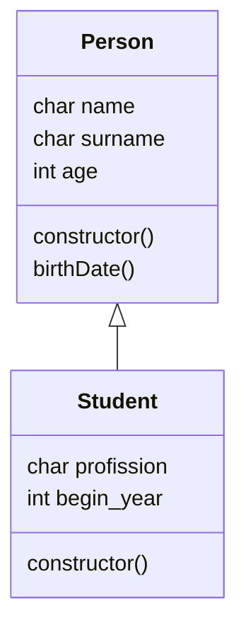

<!--(https://www.youtube.com/watch?v=oxaH9CFpeEE)-->

# Introduction
Example code to learn some function in JavaScript.

# Functions
* Name and anonymous functions (see [007_functions.js](https://github.com/jlopezsa/JavaScriptCourse/blob/main/007_functions.js)).

* Some interesting properties to get information of the functions (see file [0071_function_objects_arguments.js](https://github.com/jlopezsa/JavaScriptCourse/blob/main/0071_function_objects_arguments.js)) are: 
  * calle
  * caller

Properties example
```js
var op = function(op,v1,v2){
    console.log(`Value of arguments: ${arguments}`);
    console.log(arguments);                         // Arguments is an object. Aruments object has all parameters of the function
    console.log(arguments.callee.name);             // With Callee get the name function     
    //console.log('caller: '+arguments.callee.caller);
    if(op=="Square"){
        return square(v1)
    }
}
```
Results of command <code>comand.log(.)</code>
```powershell
Value of arguments: [object Arguments]
[Arguments] { '0': 'Square', '1': 2, '2': 4 }
op
```

# Strings
Comparing a character into string (see [009_strings.js](https://github.com/jlopezsa/JavaScriptCourse/blob/main/009_strings.js) file).

```js
const str = "Los elefantes son enormes";
function countingEs(str){
    var counter = 0;
    for (let i = 0; i < str.length; i++) {
        if (str[i] === 'e') {
            counter = counter + 1;
        }
    }
    return counter;
}
```

Using <code>replace(,)</code> function to replace a specific character into string.
```js
for (const i in str) {
        switch (str[i]) {
            case 'a':
                str = str.replace('a','4');                    
                break;
            case 'e':
                str = str.replace('e','3');                    
                break;
            case 'i':
                str = str.replace('i','1');                    
                break;
            case 'o':
                str = str.replace('o','0');                    
                break;
            default:
                break;
        }
    }
```

Changing the first letter of the message words to capital letter. Functions used:
* <code>.split()</code>
* <code>.push()</code>
* <code>.replace()</code>
* <code>.toUpperCase()</code>
* <code>.join()</code>
```js
function capitalizar(str){              // Function used to capitalizar a string
    vec_str = str.split(" ");           // Split function divides the string into a vector. Each vector position in a word of the string
    vec_upper = [];
    for (let i = 0; i < vec_str.length; i++) {
        vec_upper.push(vec_str[i].replace(vec_str[i][0],vec_str[i][0].toUpperCase()));  // Uppercase function is used to uppercase the first letter of the word. 
                                                                                        // Replace function is used to replace the lower case to capital letter.
                                                                                        // Push function is used to prench an empty vector (vec_upper)
    }
    return vec_upper.join(" ");         // Join function is used to join the words of the vector. The words are joined with a character " "
}
```
# Objects

Declaring an object, getting the properties (<code>Object.keys(object_name)</code>) and printing their values.
```js
const recipe = {
    leche_polvo: "1 litro",
    chocolate_barra: "3 barras",
    azucar: "3 gramos"
}

const llaves = Object.keys(recipe);
for (const key in llaves) {
    console.log(`${llaves[key]}: ${recipe[llaves[key]]}`);
}
```

Function to replace a specific character in string:

<code>function replaceSpecificCharacter(str,str_char,str2replace)</code>

```js
const llaves = Object.keys(recipe);
var llaves_new = new Array();
llaves_new = [];

for (const key in llaves) {
    llaves_new.push(replaceSpecificCharacter(llaves[key],'_',' '));
}

function replaceSpecificCharacter(str,str_char,str2replace){           // <<----- Interesting function ------
    str = str.replace(str_char,str2replace); 
    while (str.indexOf(str_char)!==-1) { // loop to replace "_" to " ". Insert space
        str = str.replace(str_char,str2replace);
    }
    // str is a vector without space character
    return str;
}

for (const key in llaves) {
    console.log(`Agrega ${recipe[llaves[key]]} de ${llaves_new[key]}`);
}
```

Another form to declare the object attributes name and list the attribute with their values:

<code>object_name.hasOwnProperty(key)</code> where <code>key</code> has the name attributes.

```js
const new_recipe = {
    "leche en polvo": "1 litro",
    "chocolate en barra": "3 barras",
    azúcar: "3 gramos"
}

for (const key in new_recipe) {
    if (new_recipe.hasOwnProperty(key)){
        console.log("Agrega " + new_recipe[key] + " de " + key);
    }
}
```

## Functions as object attributes:

Using classical method:
```js
const recipe_func = {
    "leche en polvo": "1 litro",
    "chocolate en barra": "3 barras",
    azúcar: "3 gramos",
    mixIngredients: function(){
        console.log("Mezclando los ingredientes...");
    }
};
console.log(recipe_func.mixIngredients());
```

Using concise method:
```js
const recipe_func = {
    "leche en polvo": "1 litro",
    "chocolate en barra": "3 barras",
    azúcar: "3 gramos",
    mixIngredients(){
        console.log("Mezclando los ingredientes...");
    }
}
console.log(recipe_func.mixIngredients());
```

# Class

A javascript class is a template to create objects.

The following code implements a class <code>Person</code> with initial properties <code>name, surname, and age</code>. All classes always add the <code>constructor()</code> method. This method is used to initialize the object parameters.
If the constructor isn't defined, JS creates a default constructor with empty properties.
```js
class Person{
    constructor(name,surname,age){
        this.name = name;
        this.surname = surname;
        this.age = age;
    }
}
```

The Person class is instantiated through:
```js
const student = new Person(`Carlos`,`Lopez`,38);
```
and the properties are accessed through

```js
console.log(`Hello ${student.name} ${student.surname}, you are ${student.age} years old`);
```
and message result is:
```bash
Hello Carlos Lopez, you are 38 years old
```

## Methods() 

Person class with a method().

```js
class Person{
    constructor(name,surname,age){
        this.name = name;
        this.surname = surname;
        this.age = age;
    }
    birthDate(){
        const date = new Date();    // Date{} is a JS class
        const this_moment = date.getFullYear();
        return this_moment - this.age;
    }
}
const student = new Person(`Carlos`,`Lopez`,38);

console.log(`Hello ${student.name} ${student.surname}, you are ${student.age} years old`);
console.log(`You birth date is ${student.birthDate()}`)
```

## Strict-mode use
The directive "use strict", place at beginning of js file, was porpoised by [ECMAScript5](https://262.ecma-international.org/12.0/#sec-strict-mode-code). This directive is used to, obligatorily, declare all variables used in the code.

For instance, in the followingg code:

```js
'use strict';
v = "¡Hola! ¡Strict mode in JavaScript!";
console.log(v)
```
the result is the error 
```
ReferenceError: v is not defined
```

to correct this, the variable <code>v</code> has got declare as 
```js
'use strict';
var v = "¡Hola! ¡Strict mode in JavaScript!";
console.log(v)
```

## Strict-mode into a function()
If the strict-mode directive is used in a function(), all variables in the function have got to declare. For instance, the following class, in the method <code>printMessage()</code> has the strict-mode directive:
```js
class Computer{
    constructor(marck,cpu,memory){
        this.marck = marck;
        this.cpu = cpu;
        this.memory = memory;
    }
    printMessage(){
        'use strict';
        var message = this.marck +' '+ this.memory +' ' + this.cpu;
        return message
    }
}
``` 

Therefore, the <code>message</code> variable has got to declare as <code>var message</code>, or <code>const message</code> or <code>let message</code>, according to the requirement.


# Class Inheritance

The following example shows an example of inheritance:
```js
class Person{
    constructor(name,surname,age){
        this.name = name;
        this.surname = surname;
        this.age = age;
    }
    birthDate(){
        const date = new Date();    // Date{} is a JS class
        const this_moment = date.getFullYear();
        return this_moment - this.age;
    }
}

class Student extends Person{
    constructor(name,surname,age,profission,begin_year){
        super(name,surname,age);
        this.profission = profission;
        this.begin_year = begin_year;
    }
}

var stud = new Student('Julian','Lopez',38,'Eng',2019);

console.log(stud.name);
console.log(`Your profession is ${stud.profission} and your birth year is ${stud.birthDate()}`);
```

The inheritance ma be represented through the UML class diagram:
