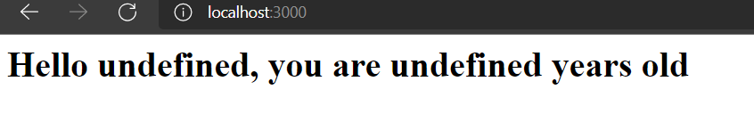
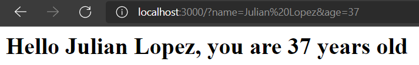
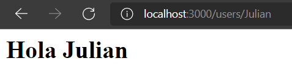
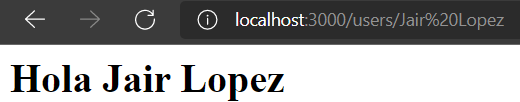
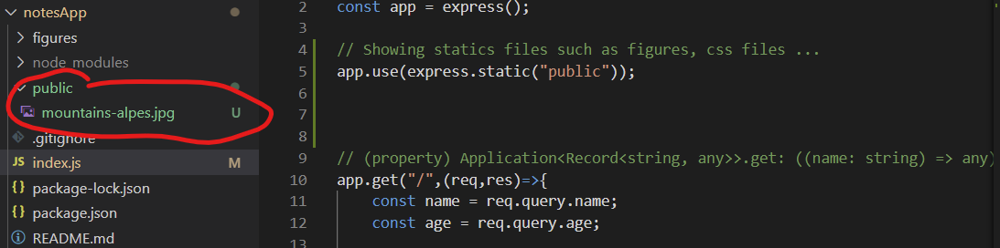
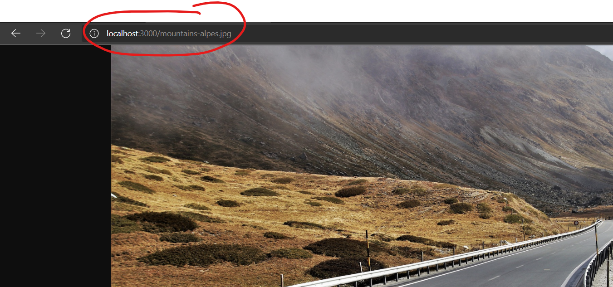
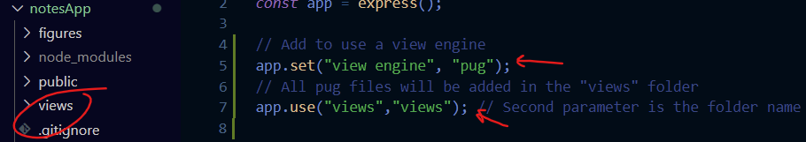
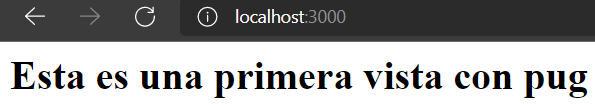
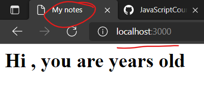
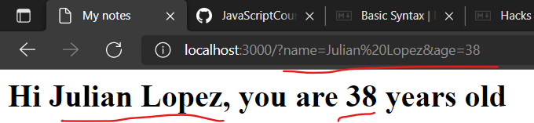

<!-- https://www.markdownguide.org/basic-syntax -->
# Notes-application with JavaScript

This project is developed following the tutorial of [Make it Real](https://www.youtube.com/watch?v=RedMWe6J0sg&list=PLxyfMWnjW2kt1i7oMIi7VQ30VOX5bDiV1&index=1) (*Curso de Node.js con Express y MongoDB)*.
The aim of the project is develop a web application to take notes. Also, it will be shown the libraries required for that.

Through the project the following topics will be shown:

* Install **Express** (minimal and flexible Node.js web application framework)
* Create **JSON file** (package.json and package-lock.json)
* Create the express application (index.js)
* **Nodemon** library, it is used to haven't got to restart the server manually. This library is installed through the sentence: <code>npm install -g nodemon</code>
  * Index.js has got to run with the sentence <code>nodemon index.js</code>
    * The following issue was presented: "la ejecución de scripts está deshabilitada en este sistema".
    * The command <code>Set-ExecutionPolicy RemoteSigned -Force</code> was required execute in powershell.
  * Executed <code>nodemon index.js</code>. Therefor, only is required refresh the browser to update the changes made into index.js
* Creating routes to get parameters using the methods: <code>express().get()</code>
* Showing statics files such as figures using the sentence <code>app.use(express.static("public"))</code>;
* Separate HTML code from JavaScript.
  * Install a view engine such as [pug](https://pugjs.org/api/getting-started.html), [mustache](http://mustache.github.io/) or [EJS](https://ejs.co/)
  * In this project will be used the [pug](https://pugjs.org/api/getting-started.html) view engine.
    * Installing pug library: <code>npm install --save pug</code>
  * Get route parameters ussing pug view engine
  

# Adding a request 

```Javascript
app.get("/",(req,res)=>{
    const name = req.query.name;
    const age = req.query.age;

    res.send(`<h1>Hello ${name}, you are ${age} years old</h1>`);
});
```






# Routes parameters

```JavaScript
app.get("/users/:name",(req,res)=>{
    const name = req.params.name;
    res.send(`<h1>Hola ${name}</h1>`)
})
```




# Showing statics files

```JavaScript
app.use(express.static("public"));
```




# View Engine



The following code should be added to configure the pug view engine
```JavaScript
// Add to use a view engine
app.set("view engine", "pug");
// All pug files will be added in the "views" folder
app.set("views","views"); // Second parameter is the folder name where will be the views files 
```
The method render of response is added in the <code>app.get()</code> method
```JavaScript
app.get("/",(req,res)=>{
    const name = req.query.name;
    const age = req.query.age;
    //res.send(`<h1>Hello ${name}, you are ${age} years old</h1>`);
    res.render("index"); // render method to call the index file
});
```

The index.js file is executed with the nodemon <code>nodemon index.js</code>

Localhost:3000 is request in the browser:



## Route parameters through pug view engine

Code in the index.js
```JavaScript
app.get("/",(req,res)=>{
    const name = req.query.name;
    const age = req.query.age;
    //res.send(`<h1>Hello ${name}, you are ${age} years old</h1>`);
    res.render("index", {name, age});   // render method to call the index file
                                        // {name,age}: Arguments to receive the values name and age
});
```

Code in the /views/index.pug

```JavaScript
html
    head
        title My notes
    body
        h1 Hi #{name}, you are #{age} years old
```




